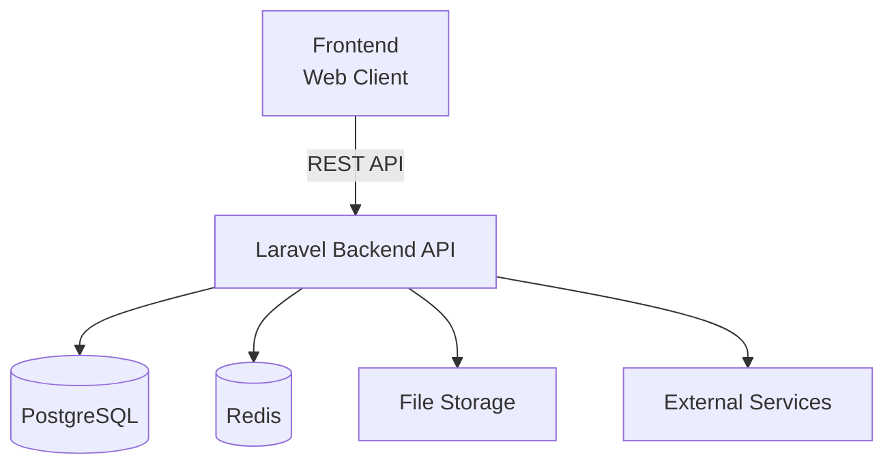
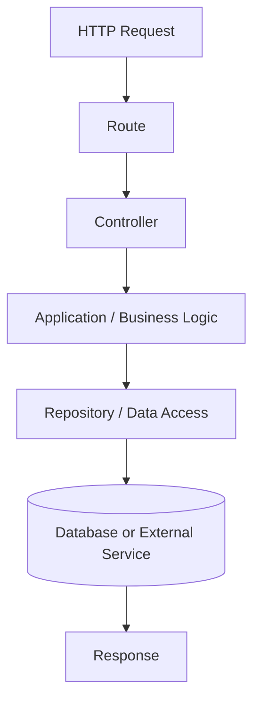

# Architecture

## Overview

Devink follows a separated frontend and backend architecture. The backend is responsible for application logic, data management, authentication, authorization, and exposing the API, while the frontend consumes the API and provides the user-facing experience.

The architecture is designed to keep the major parts of the system independently maintainable while avoiding unnecessary complexity.

At a high level, the system consists of the following components:

* **Frontend** — Provides the user interface and client-side experience.
* **Backend API** — Handles application logic, authentication, authorization, and business rules.
* **Database** — Stores persistent application data.
* **Cache & Queue** — Supports caching, background processing, and asynchronous tasks where required.
* **File Storage** — Stores user-uploaded and application-managed files.
* **External Services** — Provides capabilities that are better handled by specialized external services.

## System Architecture

Devink uses an API-driven architecture in which the frontend communicates with the backend through a versioned REST API.

The frontend should not directly access the database or internal backend services. All application data and business operations should go through the public API.

## Backend

The backend is built with Laravel and acts as the primary application layer of Devink.

It is responsible for:

* Business rules
* Authentication
* Authorization
* Input validation
* Content management
* User and profile management
* Search and discovery
* Comments and interactions
* Notifications
* Moderation
* API responses

The backend should remain independent from the presentation layer so that the API can serve different clients in the future if required.

## Frontend

The frontend is developed as a separate application and communicates with Devink through the backend API.

Its primary responsibilities include:

* User interface
* Navigation
* Content presentation
* User interactions
* Client-side state
* Form handling
* Client-side validation where appropriate

The frontend should not contain core business rules that need to be enforced by the backend.

The exact frontend technology and architecture are documented separately once they are finalized.

## API

The backend exposes a versioned REST API as the primary communication interface between the frontend and backend.

The API provides access to application resources and operations while keeping the internal implementation details of the backend hidden from clients.

!!! note

    API conventions, resource definitions, request and response formats, authentication, and error handling are documented in the [API Documentation](../api.md).
    The API contract is defined using OpenAPI.

## Authentication & Authorization

Authentication is handled by the backend API.

The system is responsible for identifying users and determining whether they are authorized to perform specific operations.

Authorization should be enforced on the server side regardless of any restrictions implemented by the frontend.

Access control should follow the principle of least privilege, allowing users to access only the resources and operations they are permitted to use.

## Application Structure

The backend should be organized around clear application responsibilities rather than allowing business logic to become concentrated in controllers or other framework-specific components.

A typical request should follow a flow similar to:

The exact implementation of these layers may evolve as the project grows.

The architecture should favor clear boundaries, testability, and maintainability over following a particular architectural pattern for its own sake.

## Data Layer

PostgreSQL is used as the primary persistent data store.

The database is responsible for storing core application data such as:

* Users
* Profiles
* Articles
* Tags
* Comments
* Reactions
* Follows
* Bookmarks
* Notifications
* Moderation records

!!! note

    Database structure, relationships, constraints, and indexing strategies are documented in the [Database Documentation](../database.md).

## Caching & Background Processing

Redis may be used for temporary or frequently accessed data and for background processing where appropriate.

Background jobs should be used for operations that do not need to block the main request, such as certain notification, email, or processing tasks.

Caching should be introduced where it provides a measurable benefit and should not be used prematurely.

## File Storage

Files such as avatars, article images, and other user-uploaded assets should be stored separately from the primary database.

The application should interact with file storage through an abstraction layer where practical, allowing the underlying storage provider to be changed without significant changes to application logic.

## External Services

Devink may depend on external services for capabilities such as:

* Email delivery
* Object or file storage
* Search
* Monitoring and observability
* Other infrastructure services

External services should be isolated behind clear boundaries and should not unnecessarily couple the core application to a specific provider.

## Security Architecture

Security is considered a cross-cutting concern across the entire system.

The architecture should provide appropriate protection for:

* Authentication credentials
* User data
* API endpoints
* User-generated content
* File uploads
* Application secrets
* Internal services

!!! note

    Detailed security requirements and practices are documented in the [Security Documentation](../security.md).

## Scalability

Devink should be designed to scale incrementally as usage grows.

The initial architecture should remain simple enough to develop and operate efficiently while allowing individual components to scale independently when necessary.

Potential scaling strategies may include:

* Horizontal scaling of the backend
* Database optimization and read scaling
* Redis-based caching
* Background job workers
* Separate file storage
* Dedicated search infrastructure

These mechanisms should be introduced based on actual requirements rather than anticipated scale.

## Observability

The system should provide sufficient logging, monitoring, and health checks to understand its operational state.

Important application and infrastructure events should be observable without exposing sensitive information.

!!! note

    Observability requirements and operational procedures are documented in the [Operations Documentation](../operations.md).

## Architecture Principles

The architecture of Devink follows several principles.

### Separation of Concerns

Each part of the system should have a clear responsibility and avoid unnecessary coupling with other components.

### Simplicity

The simplest architecture that satisfies the current requirements should be preferred.

### Maintainability

The system should remain understandable and easy to modify as the project evolves.

### API-First Communication

The backend and frontend should communicate through a clearly defined API contract.

### Security by Design

Security should be considered as part of architectural decisions rather than added after implementation.

### Incremental Scalability

The architecture should allow the system to grow without introducing infrastructure complexity before it is needed.

## Architecture Decisions

Important architectural decisions and their rationale are documented separately as Architecture Decision Records (ADRs).

ADRs should be created when a decision has meaningful long-term consequences or when the reasoning behind a technical choice may be useful to future contributors.

!!! note

    See the [Architecture Decisions](decisions/index.md) section for the complete list.

## Evolution

The architecture of Devink is expected to evolve with the product.

Architectural changes should be driven by actual requirements, technical constraints, operational experience, and the long-term direction of the product.

The goal is not to design a system capable of handling every possible future scenario from the beginning, but to establish a solid foundation that can evolve without unnecessary complexity.
