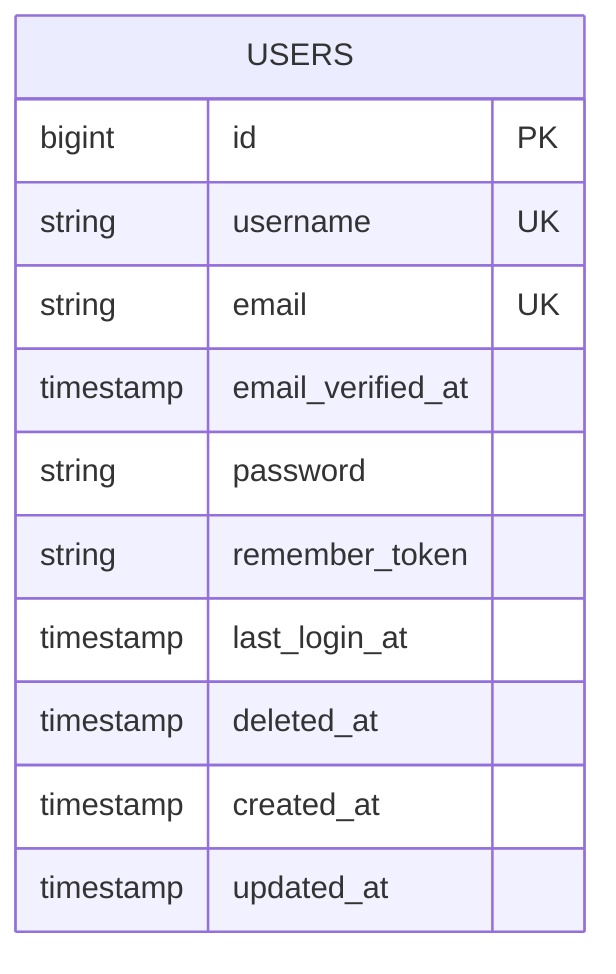

# Database

## Database Technology

Devink uses **PostgreSQL** as its primary relational database.

The application interacts with PostgreSQL through **Laravel Eloquent**, while database schema changes are managed using **Laravel Migrations**.

The database is shared across features, while each feature remains responsible for the data it owns.

---

## ERD



---

## Tables

### users

Stores the core account and authentication-related information of users.

| Column              | Type      | Nullable | Description                     |
| ------------------- | --------- | -------- | ------------------------------- |
| `id`                | BIGINT    | No       | Primary identifier              |
| `username`          | VARCHAR   | No       | Unique public username          |
| `email`             | VARCHAR   | No       | Unique user email               |
| `email_verified_at` | TIMESTAMP | Yes      | Email verification timestamp    |
| `password`          | VARCHAR   | No       | Hashed password                 |
| `remember_token`    | VARCHAR   | Yes      | Laravel remember-me token       |
| `last_login_at`     | TIMESTAMP | Yes      | Last successful login timestamp |
| `deleted_at`        | TIMESTAMP | Yes      | Soft deletion timestamp         |
| `created_at`        | TIMESTAMP | No       | Record creation timestamp       |
| `updated_at`        | TIMESTAMP | No       | Last record update timestamp    |

---

## Relationships

The `users` table currently has no database-level relationship with another table documented yet.

Future relationships should be added here as new tables and features are introduced.

---

## Indexes

The following indexes are currently required:

| Column     | Type        | Purpose                      |
| ---------- | ----------- | ---------------------------- |
| `id`       | Primary Key | Unique record identification |
| `username` | Unique      | Enforce username uniqueness  |
| `email`    | Unique      | Enforce email uniqueness     |

Additional indexes should be introduced based on actual query and access patterns.

---

## Important Constraints

### `username`

* Must be unique.
* Cannot be null.
* Must follow the application's username validation rules.

### `email`

* Must be unique.
* Cannot be null.

### `password`

* Must contain a hashed password.
* Plain-text passwords must never be stored.

### `email_verified_at`

May be null until the user's email address is verified.

### `last_login_at`

May be null when the user has not logged in yet.

### `deleted_at`

Used for soft deletion of user accounts.

---

## Data Lifecycle

A user record follows the following general lifecycle:

```text
Created
   ↓
Active
   ↓
Updated
   ↓
Soft Deleted
```

Soft deletion does not physically remove the record from the database.

The user model uses Laravel's `SoftDeletes` behavior, allowing deleted accounts to remain available for controlled recovery or data-management operations.

Permanent deletion is not currently part of the standard user lifecycle.
