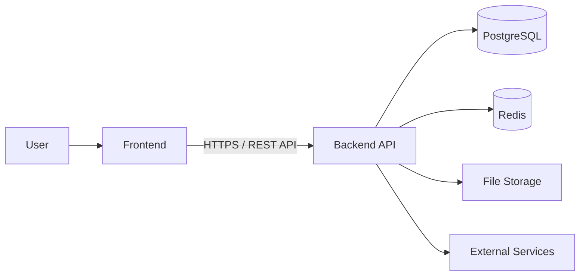

# ADR-001: Separate Frontend and Backend

* **Status:** Accepted
* **Date:** 2026-08-26
* **Decision:** Separate the frontend and backend into independent applications.

## Context

Devink needs a clear boundary between the user-facing application and the application's core logic.

We considered both a traditional server-rendered application and a separated frontend/backend architecture. We chose to separate them so that each part can evolve independently while communicating through a well-defined API.

## Decision

The frontend and backend are maintained as separate applications.

The backend is responsible for:

* Business rules
* Data access
* Authentication and authorization
* Validation
* Application workflows
* API contracts

The frontend is responsible for:

* User interface
* Navigation
* Presentation
* Client-side state
* User interactions

The frontend must not directly access the database or depend on internal backend implementation details.

Communication between them happens through a versioned REST API.

## Rationale

This separation provides:

* **Clear responsibilities** — Presentation and application logic remain independent.
* **Independent evolution** — Frontend and backend can change without being tightly coupled.
* **Explicit API contract** — Clients depend on defined API behavior rather than backend internals.
* **Technology flexibility** — The frontend and backend can use different technologies and evolve independently.
* **Multiple clients** — The same backend can support future clients such as mobile applications or integrations.
* **Centralized business logic** — Authoritative business rules remain enforced by the backend.

## Alternatives Considered

### Server-Rendered Monolith

A single Laravel application could handle both presentation and application logic.

**Pros:**

* Simpler setup
* Fewer moving parts
* Simpler deployment

**Cons:**

* Tighter frontend/backend coupling
* Less flexibility for other clients
* Frontend technology is more closely tied to the backend

### Server-Driven Frontend

A single Laravel application using a solution such as Inertia.js was also considered.

This provides a simpler development model than a fully separated frontend, but keeps the frontend more closely coupled to Laravel.

### Separate Frontend and Backend

**Selected.**

The additional complexity of maintaining two applications is accepted in exchange for clear boundaries, independent evolution, and an explicit API contract.

## Consequences

### Positive

* Clear separation of responsibilities
* Independent development and deployment
* Reusable backend API
* Greater technology flexibility
* Easier support for future clients

### Negative

* More complex local development
* Separate deployment concerns
* API design and versioning become important
* Authentication requires coordination between applications
* Debugging may require tracing requests across the API boundary

## What This Does Not Mean

This decision does **not** imply a microservices architecture.

Devink will continue to have a single backend application unless a future ADR changes that decision.

Logical separation also does not require separate servers, containers, or infrastructure.

## Reconsideration

This decision may be reconsidered if the separation introduces unnecessary complexity, the product becomes primarily server-rendered, or the API boundary is no longer valuable.

Any major change should be documented through a new ADR.
