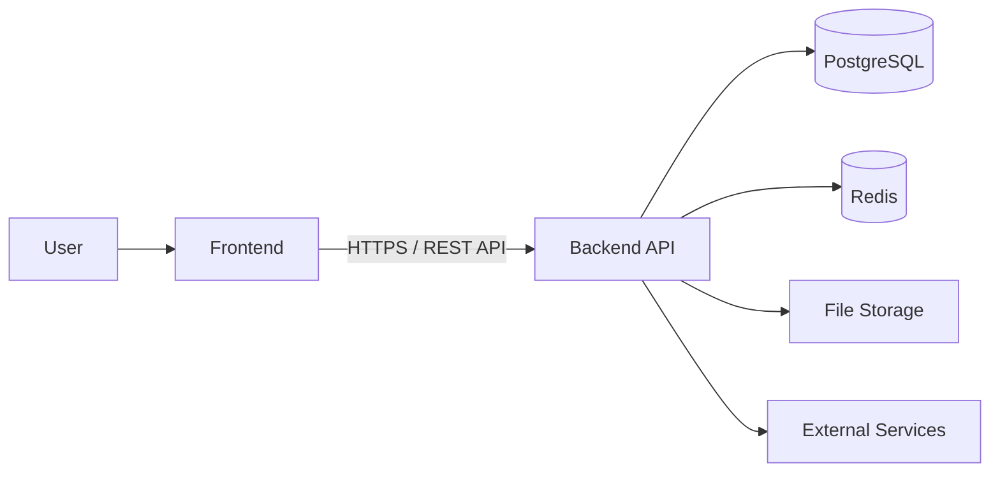
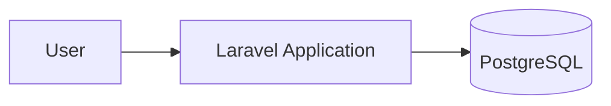
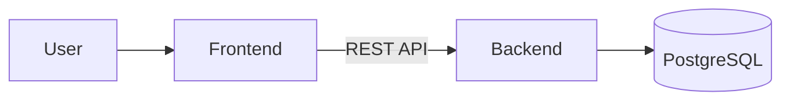
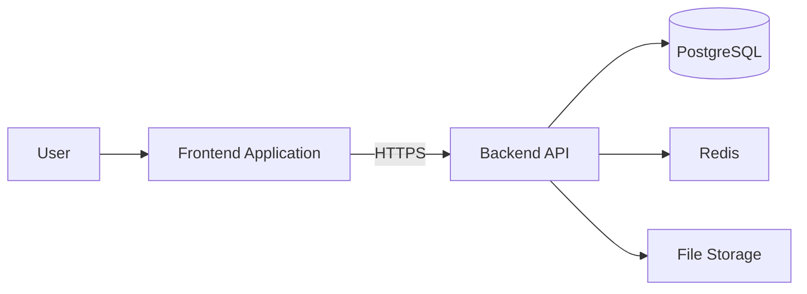

# ADR-001: Separate Frontend and Backend

* **Status:** Accepted
* **Date:** 2026-08-26
* **Decision:** Separate the frontend and backend into independent applications.
* **Scope:** Application architecture

## Context

Devink is designed as a web application with a dedicated backend responsible for application logic, data management, authentication, authorization, and API delivery.

A fundamental architectural decision is whether the frontend and backend should be implemented as a single application or as two independently developed applications.

There are several possible approaches.

The application could use a traditional server-rendered architecture in which the backend is responsible for both rendering pages and handling application logic. Alternatively, the frontend and backend could be separated, with the backend exposing an API and the frontend consuming that API.

For Devink, we chose the second approach.

The frontend and backend are therefore treated as separate applications with a clearly defined API boundary between them.

## Decision

We will maintain the frontend and backend as **separate applications**.

The backend will expose a versioned REST API, while the frontend will consume that API and be responsible for the user-facing experience.

The backend owns:

* Business rules
* Data access
* Authentication
* Authorization
* Validation
* Application workflows
* API contracts

The frontend owns:

* User interface
* Navigation
* Presentation
* Client-side state
* User interactions
* Client-side form behavior

The frontend must not directly access the database or depend on internal backend implementation details.

Communication between the two applications happens through the public API.

This separation is a boundary between responsibilities, not merely a separation between directories or repositories.

## Why We Chose This Architecture

### Independent Responsibilities

The frontend and backend solve different problems.

The frontend is primarily concerned with presenting information and handling user interaction, while the backend is responsible for application behavior, data, and business rules.

Keeping these responsibilities separate makes the boundaries of each part of the system clearer.

### Independent Evolution

The frontend and backend should be able to evolve independently.

A change to the frontend should not require changes to backend presentation code, and backend improvements should not require modifying frontend implementation details unless the API contract changes.

This allows each side to evolve according to its own technical requirements.

### API as a Clear Contract

The API provides an explicit contract between the two applications.

Instead of the frontend depending on internal backend classes, controllers, database queries, or framework-specific behavior, it depends on defined API resources and operations.

This creates a stable boundary between the two systems.

### Future Clients

The backend should not be limited to serving a single frontend.

Although the initial client is the Devink web frontend, the API architecture leaves room for additional clients in the future, such as:

* Mobile applications
* Desktop applications
* Alternative web clients
* Administrative interfaces
* Third-party integrations

These clients can consume the same backend API without requiring the backend to become responsible for their presentation layer.

### Technology Independence

The frontend and backend should not be tightly coupled to the same technology stack.

The backend can continue to use Laravel while the frontend can evolve independently.

Similarly, replacing or significantly changing the frontend technology should not require rebuilding the backend application.

The API acts as the compatibility boundary between the two.

### Better Separation of Business Logic

Business rules should live on the backend rather than being duplicated across clients.

The frontend may implement client-side validation and interaction logic for a better user experience, but authoritative business rules must remain enforced by the backend.

This prevents the frontend from becoming a second implementation of the application's core business logic.

### Independent Development

Separating the applications makes it possible for frontend and backend development to happen with less coordination.

Developers can work independently as long as they respect the API contract.

This becomes increasingly valuable as the project and development team grow.

## Alternatives Considered

### Monolithic Server-Rendered Application

In this approach, the backend would render the application's HTML pages and handle both presentation and application logic.

A simplified structure would look like:

#### Advantages

* Simpler initial setup
* Fewer moving parts
* No separate frontend application
* No API boundary required for the web UI
* Easier deployment for a small application
* Potentially simpler authentication

#### Disadvantages

* Frontend and backend become more tightly coupled
* Frontend technology is constrained by the backend application
* Reusing the backend for other clients becomes less straightforward
* Large frontend changes can become closely tied to backend implementation
* The presentation layer becomes part of the backend application

This approach is valid for many applications, but it does not align as well with the long-term direction of Devink.

### Monolithic Application with Server-Driven Frontend

Another option would be to keep a single Laravel application while using technologies such as Inertia.js to provide a more application-like frontend experience.

This can provide a good developer experience while avoiding many of the complexities of a completely separate frontend.

However, the frontend would still remain closely connected to the Laravel application and its conventions.

For Devink, the explicit API boundary provides a stronger separation between the client and the application layer.

### Separate Frontend and Backend

This is the selected approach.

#### Advantages

* Clear separation of responsibilities
* Independent frontend and backend evolution
* Explicit API contract
* Ability to support multiple clients
* Technology independence
* Independent development and deployment
* Clear boundary around business logic

#### Disadvantages

* More infrastructure
* More complex local development
* Separate deployment pipelines
* API design and versioning become important
* Authentication between frontend and backend requires additional consideration
* CORS and related cross-origin concerns may need to be handled
* Changes to the API contract require coordination between clients and backend

The additional complexity is accepted because the architectural benefits are relevant to the long-term direction of Devink.

## Trade-offs

Separating the frontend and backend is not inherently better than a monolithic architecture.

It introduces additional complexity.

We explicitly accept the following costs:

* Two applications instead of one
* More configuration
* More deployment concerns
* API maintenance
* Contract management
* Additional authentication considerations
* More complex local development

These costs are considered acceptable because the separation provides a stronger architectural boundary and allows the frontend and backend to evolve independently.

The decision is therefore based on Devink's requirements and expected evolution rather than treating frontend/backend separation as a universal best practice.

## Consequences

### Positive Consequences

* Frontend and backend have clear ownership boundaries.
* Business logic remains centralized in the backend.
* The API becomes an explicit architectural contract.
* Additional clients can be introduced without redesigning the backend around presentation concerns.
* Frontend and backend technologies can evolve independently.
* Each application can be tested and developed independently.
* Deployment strategies can evolve independently.

### Negative Consequences

* The system has more moving parts.
* API design becomes an important part of development.
* Authentication and authorization require coordination between the frontend and backend.
* Local development requires running multiple applications.
* Deployment requires managing multiple applications.
* Debugging problems that cross the API boundary can require tracing requests through both systems.

## Boundaries

The separation does not mean that every concern must be duplicated.

The following rules apply:

### Backend Owns

* Persistent data
* Business rules
* Authorization
* Authentication
* Data integrity
* Server-side validation
* Application workflows

### Frontend Owns

* Presentation
* User interaction
* Navigation
* Client-side state
* UI-specific behavior
* User experience

### Shared Through the API

* Resource representations
* Request and response formats
* Authentication mechanisms
* Error formats
* Pagination
* Filtering and sorting conventions

The API is the only supported communication boundary between the frontend and backend.

## API Contract

Because the frontend depends on the backend API, the API contract becomes a critical part of the architecture.

API changes should therefore be treated as changes to an architectural boundary.

The API should:

* Use explicit resource definitions
* Follow consistent naming conventions
* Define request and response formats
* Provide predictable error responses
* Define authentication requirements
* Support versioning when breaking changes are introduced
* Be documented using OpenAPI

The frontend should depend only on documented API behavior and should not rely on undocumented backend implementation details.

## Deployment Model

The frontend and backend are considered independently deployable applications.

A simplified deployment model is:

The exact deployment infrastructure may change over time without changing this architectural decision.

For example, both applications may initially be deployed on the same physical or virtual infrastructure and later move to separate infrastructure if operational requirements justify it.

**Logical separation does not require physical separation.**

This distinction is important: the architectural decision concerns application boundaries, not necessarily separate servers, containers, or cloud providers.

## What This Decision Does Not Mean

This ADR does not require:

* Microservices
* Multiple backend services
* Multiple databases
* Kubernetes
* Separate servers for every component
* Independent databases for frontend and backend
* Over-engineered infrastructure

Devink remains a single backend application unless a future architectural decision explicitly changes that.

The purpose of this decision is to separate the **frontend client from the backend application**, not to turn Devink into a distributed system unnecessarily.

## Future Reconsideration

This decision may be reconsidered if the requirements of Devink change significantly.

Examples include:

* The frontend and backend separation creates unnecessary operational complexity.
* The application becomes primarily server-rendered.
* The API is no longer required as an independent interface.
* Development velocity is negatively affected by the separation.
* Product requirements change significantly.

Any reversal or major modification of this decision should be documented through a new ADR rather than silently changing the architecture.

## Related Decisions

* [Architecture](../architecture.md)
* [API Documentation](../api.md)
* [Database Documentation](../database.md)

## Summary

Devink separates its frontend and backend because they represent different responsibilities and are expected to evolve independently.

The backend provides the application's core behavior and data through a versioned REST API, while the frontend focuses on presentation and user interaction.

This approach introduces additional complexity compared with a traditional monolithic application, but that complexity is intentionally accepted in exchange for a clear API boundary, independent evolution, technology flexibility, and the ability to support additional clients in the future.
