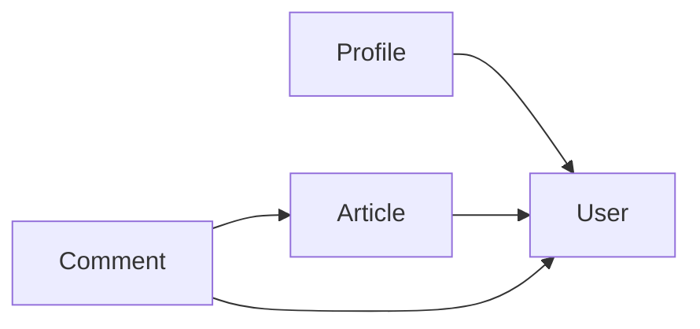

# ADR-003: Feature-Based Backend Structure

* **Status:** Accepted
* **Date:** 2026-08-27
* **Decision:** Organize the backend around business features rather than global technical layers.

## Context

As Devink grows, organizing the backend only by technical concerns can make related code increasingly scattered across the project.

For example, a user-related feature may require controllers, models, requests, services, repositories, policies, and other components. In a traditional layered structure, these files are placed in separate global directories, making a single feature span many unrelated locations.

We want the project structure to reflect the application's business boundaries and keep related functionality close together.

## Decision

The backend will be organized around **features**.

Each feature represents a meaningful business capability of Devink and owns the code required to implement that capability.

A simplified structure is:

```text
app/
├── Features/
│   ├── User/
│   ├── Profile/
│   ├── Article/
│   ├── Comment/
│   ├── Bookmark/
│   └── ...
│
└── Shared/
```

A feature may contain its own internal structure:

```text
Features/
└── Article/
    ├── Controllers/
    ├── Models/
    ├── Requests/
    ├── Policies/
    ├── Repositories/
    └── ...
```

The exact internal structure of a feature may evolve as the feature becomes more complex.

The important boundary is the **feature itself**, not a rigid set of folders inside every feature.

## Rationale

### Cohesion

Code that belongs to the same business capability stays together.

Instead of searching across multiple global directories, developers can find most of the implementation of a feature within its own boundary.

### Clear Business Boundaries

Features make the business structure of the application visible in the codebase.

For example:

```text
Features/
├── User/
├── Profile/
├── Article/
├── Comment/
└── Notification/
```

This makes the organization of the code reflect the organization of the product.

### Easier Maintenance

Changes to a feature are more likely to remain within that feature's boundary.

### Controlled Dependencies

Features should depend on other features through clearly defined interfaces or shared components rather than directly reaching into their internal implementation.

For example, `Profile` may depend on `User`, but it should depend only on what it actually needs from the `User` feature.

This encourages explicit dependencies and reduces accidental coupling.

### Better Scalability of the Codebase

Feature-based organization scales the **codebase structure** as the application grows.

Adding a new business capability generally means adding a new feature rather than distributing its files across existing global technical directories.

## Alternatives Considered

### Global Layer-Based Structure

A traditional Laravel structure could organize the entire application by technical responsibility:

```text
app/
├── Models/
├── Controllers/
├── Requests/
├── Services/
├── Repositories/
└── Policies/
```

This is simple initially, but as the application grows, code belonging to the same feature becomes distributed across many directories.

### Feature-Based Structure

**Selected.**

```text
app/
└── Features/
    ├── User/
    ├── Profile/
    ├── Article/
    └── Comment/
```

This keeps business-related code together while still allowing each feature to use familiar architectural components internally.

## Considerations

### Feature Dependencies

Features are not completely isolated.

A feature may require capabilities provided by another feature.

For example:



Such dependencies are acceptable when they represent real business relationships.

However, dependencies should remain explicit and preferably one-directional where possible.

A feature should not directly depend on another feature's internal implementation unless there is a strong reason to do so.

### Shared Components

Not everything belongs to a feature.

Some capabilities are genuinely shared across the application and should live outside individual features.

For example:

```text
app/
├── Features/
│   ├── User/
│   ├── Article/
│   └── Profile/
│
└── Shared/
    ├── ...
```

`Shared` should remain intentionally small.

Code should be placed there only when it is truly cross-feature infrastructure or functionality and does not naturally belong to a specific feature.

Shared code should not become a dumping ground for functionality that has unclear ownership.

## What This Decision Does Not Mean

Feature-based organization does **not** mean that Devink is a microservices architecture.

All features initially live within the same Laravel application and share the same runtime and database.

The boundary is primarily a **code organization and dependency boundary**, not a deployment boundary.

It also does not require every feature to have an identical internal structure.

## Consequences

### Positive

* Business capabilities are visible in the project structure.
* Related code stays together.
* Feature-level changes are easier to locate.
* Dependencies between business areas become more explicit.
* Features can evolve independently.
* The structure scales better as the codebase grows.

### Negative

* Feature boundaries require deliberate design.
* Some functionality may be difficult to classify initially.
* Cross-feature dependencies need careful management.
* Developers must avoid turning `Shared` into a generic dumping ground.
* Moving existing Laravel conventions into a feature-based structure may require additional project configuration.

## Reconsideration

This decision may be reconsidered if feature boundaries consistently create more complexity than value, or if the project's scale and requirements make another organizational strategy more appropriate.

Any major change to the backend's structural organization should be documented through a new ADR.
